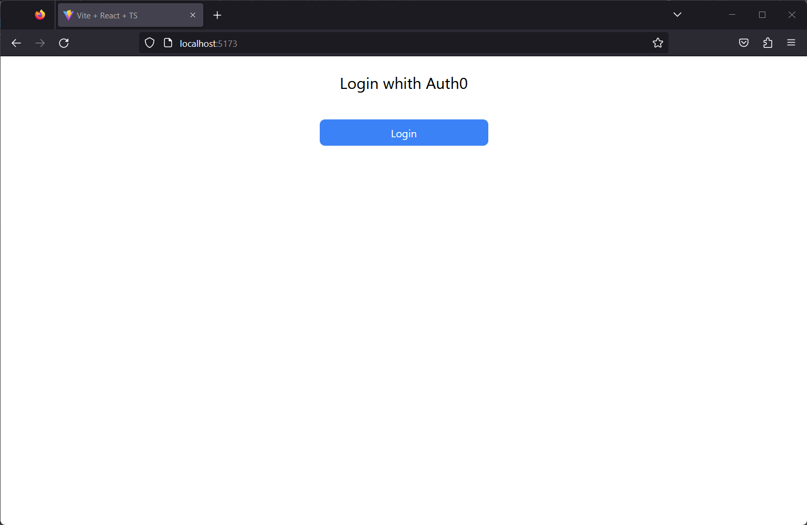
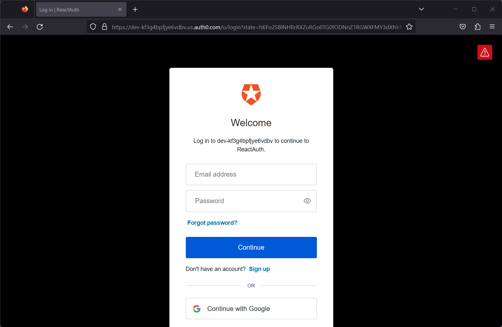
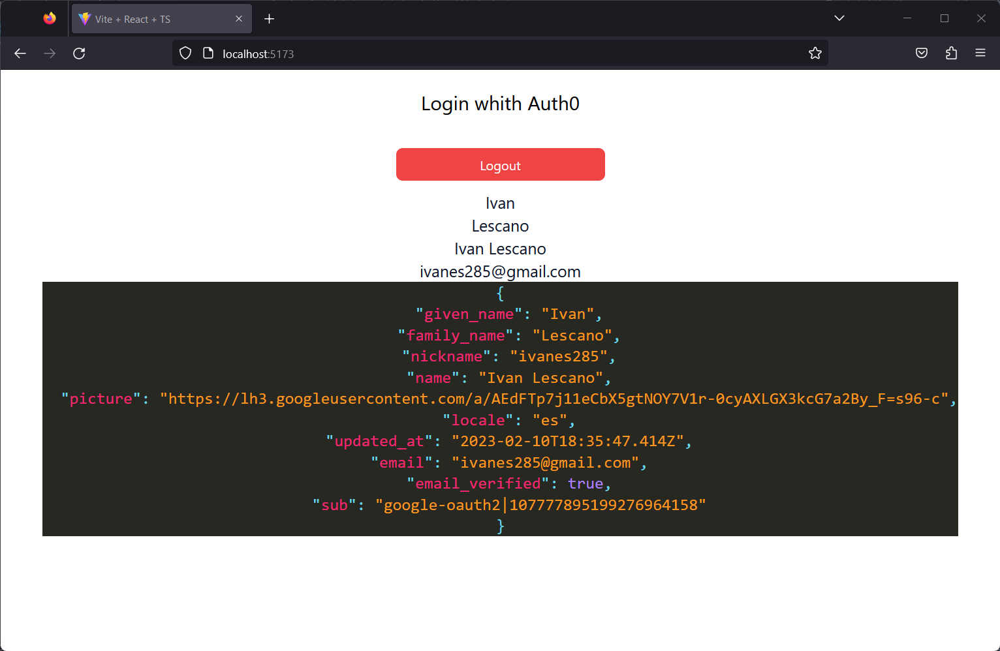

# ReactAuth0
- Aplicación frontend que hace uso del provedor de autenticación y autorización [Auth0 Web](https://auth0.com/es)
- Una vez logeados nos dirigimos a la seccion Aplicationes/aplicaciones y procedemos a crear una nueva aplicación dependiendo de la plataforma que deseemos, en este caso se creara una aplicación para frontend con React.
- Luego nos dirigiremos a settings/aplicationsURIS y colocaremos el dominio de nuestra aplicacion y el puerto en el que se ejecutara en este caso como estamos usando vitejs con typescript el dominio es el siguiente:
```
http://localhost:5173
```
- Lo copiamos en el campo de Allowed Callback URLs , Allowed Logout URLs y en Allowed Web Origins 
## Instalación de Modulos
- La documentacion con respecto a React [QuickStart](https://manage.auth0.com/dashboard/us/dev-kf3g4bpfjye6vdbv/applications/dvYW40wQSpBYRF8xQKaV72u4NuZk4KQN/quickstart) nos dice que debemos instalar los siguientes modulos:
```
npm install @auth0/auth0-react
```
- El Modulo nos provee de diferentes metodos que se usaron en varios componentes como Login, Logout, Profile  

##Deploy
- La app frontend se desplego en railway , tome en cuenta la configuracion en el archiv package.json el comando start que permitio que se pueda desplegar
### Environment Variables
VITE_DOMAIN=dominio
VITE_CLIENTID=clientid
- Si quieres visualizar el despligues puedes hacerlo en [Link](https://reactauth0-production.up.railway.app/)
- Toma en cuenta que en este caso produccion tuvimos que cambiar de nuevo en settings/aplicationsURIS y colocaremos el nuevo dominio de nuestra aplicacionç
 ```
 https://reactauth0-production.up.railway.app
 ```
 

### Preview


<p align="center">
    
<p/>


<p align="center">
    
<p/>

<p align="center">
    
<p/>
